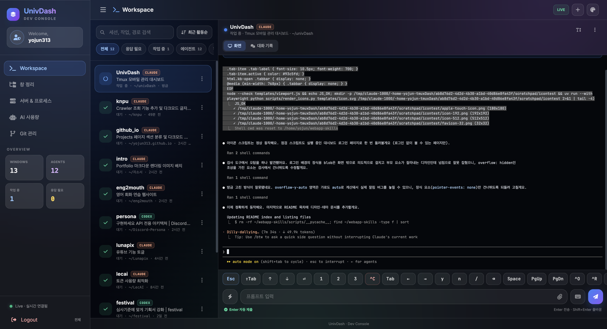
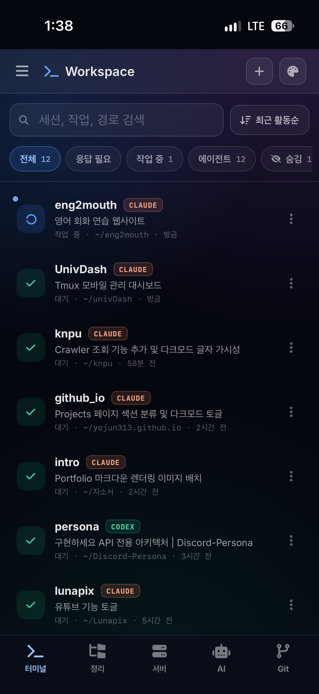
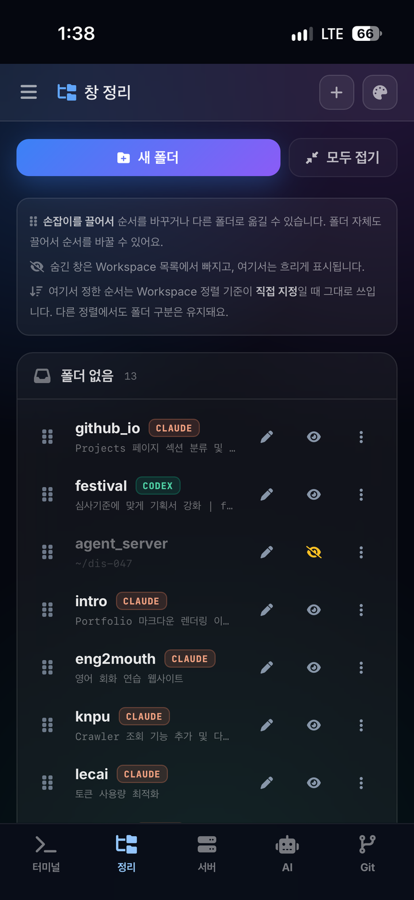
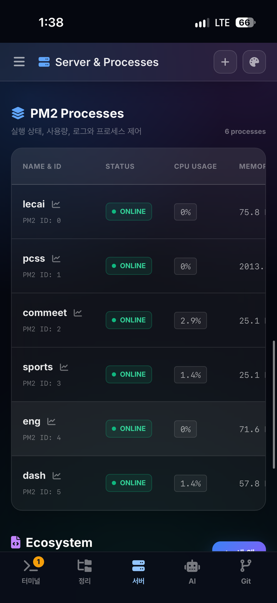
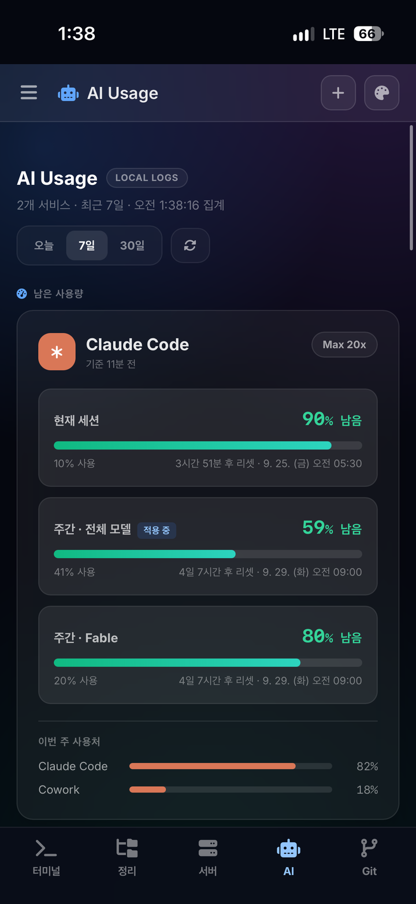
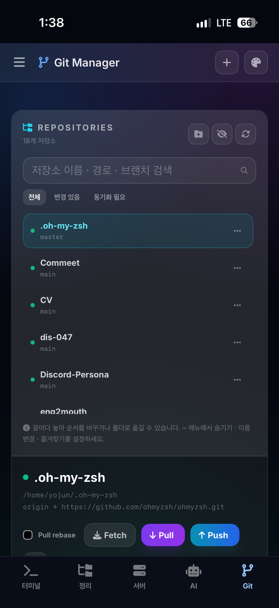
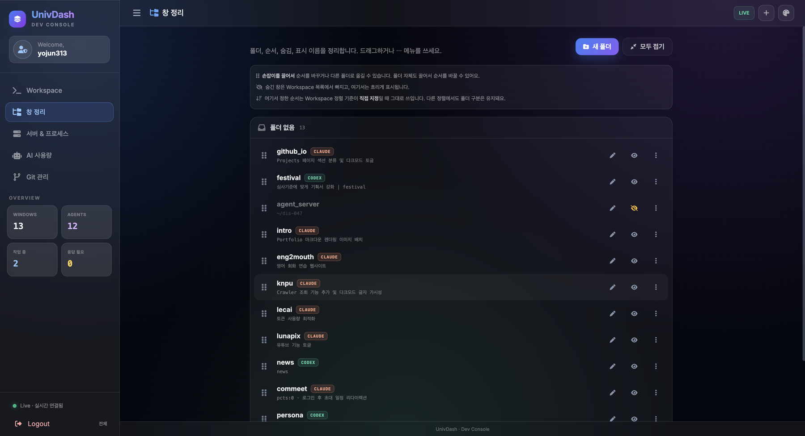
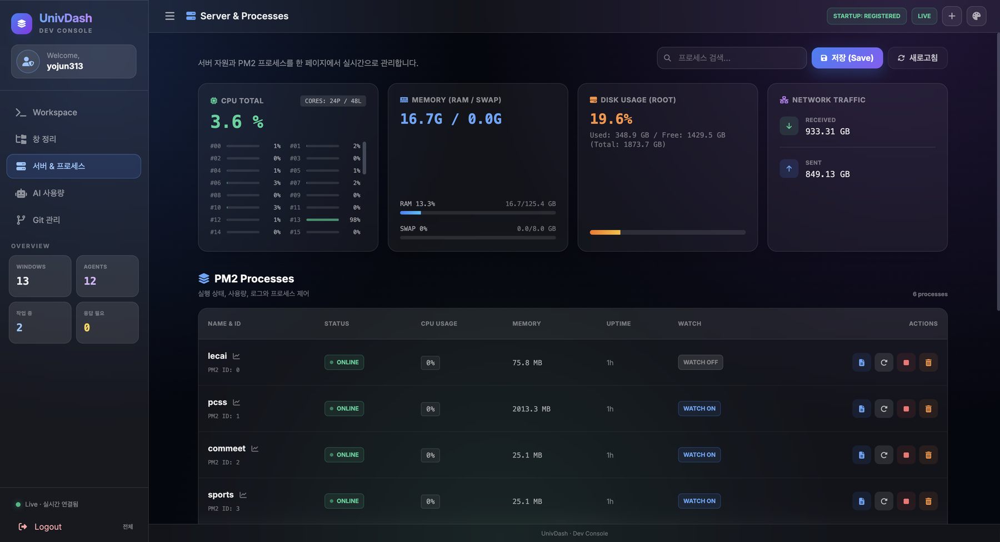
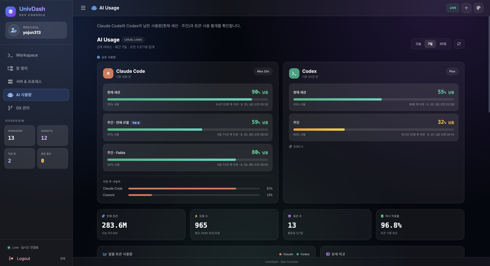
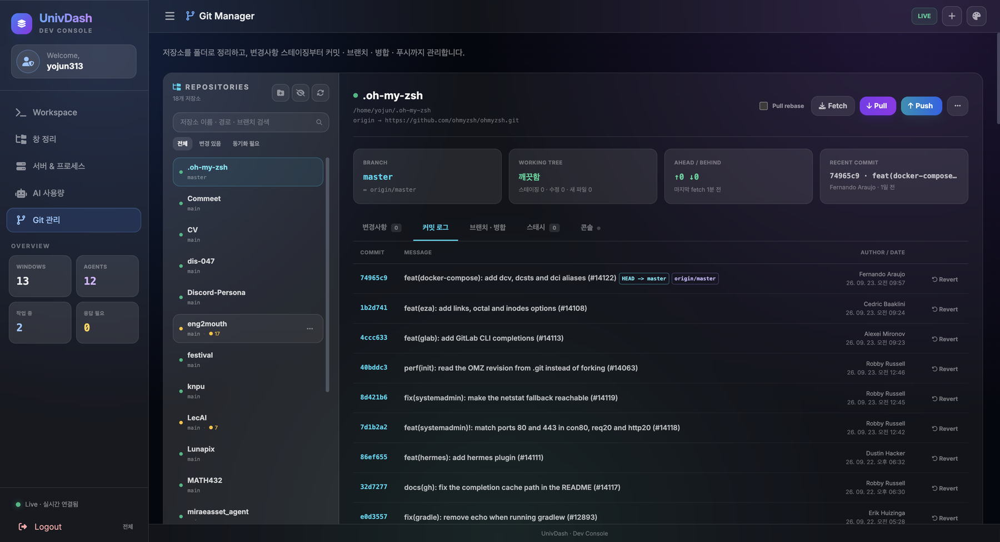

# UnivDash

A self-hosted dashboard for **driving Claude Code and Codex from your phone**. Every tmux window on the server shows up in one list: see which agent is working, which one is waiting for your answer, read the full conversation, and send the next prompt (with photos and files) from anywhere. The same console also manages **server resources, PM2 processes, AI usage limits and Git repositories**.

Built as a mobile-first web app (installable to the iPhone home screen as a PWA) on FastAPI, with no database and no external CDN.

<p align="center">
  
</p>

<table>
  <tr>
    <td align="center" width="20%"><br><sub>Workspace</sub></td>
    <td align="center" width="20%"><br><sub>Organizer</sub></td>
    <td align="center" width="20%"><br><sub>Server</sub></td>
    <td align="center" width="20%"><br><sub>AI Usage</sub></td>
    <td align="center" width="20%"><br><sub>Git</sub></td>
  </tr>
</table>

<table>
  <tr>
    <td align="center" width="50%"><br><sub>Window organizer: folders, drag-to-reorder, hide, rename</sub></td>
    <td align="center" width="50%"><br><sub>Server resources, PM2 processes and ecosystem.config.js</sub></td>
  </tr>
  <tr>
    <td align="center" width="50%"><br><sub>Claude Code / Codex remaining limits and token statistics</sub></td>
    <td align="center" width="50%"><br><sub>Git: stage, commit, branch, merge, stash, push</sub></td>
  </tr>
</table>

---

## 1. Features

* **Workspace for coding agents**: every tmux window in one list with the running agent (Claude Code / Codex / shell), the task title the agent set, working directory and last activity. Status is detected per window: *working*, *needs your answer* (permission / choice prompts) or *idle*, with an unread dot when a reply arrived that you have not seen.
* **Sorting & filters**: by status (unread replies first, then working, needs answer, idle), recent activity, name, or your own order. Filter chips for needs-answer / working / agents, search, and hidden windows.
* **Prompt from the phone**: a chat-style composer that sends multi-line prompts as a bracketed paste (no line-by-line submits), per-window drafts, quick phrases and recent prompts, plus a key bar for `Esc`, `⇧Tab`, arrows, `1/2/3`, `y/n`, `^C`, `^O`, `PgUp/PgDn`… that never closes the keyboard.
* **Direct terminal mode**: every key you press goes straight to the pane, including Korean IME input on iOS / Android.
* **Live screen and full conversation history**: the pane is streamed with ANSI colors and cursor (wrap / fit-to-width / raw views). Because Claude Code draws on the alternate screen and leaves no tmux scrollback, a *Conversation* tab reads the agent's own session log (`~/.claude`, `~/.codex`) so you can scroll the whole conversation from the first prompt, with collapsible tool calls and live updates.
* **Photos & files**: attach from the photo library / camera / files, paste a screenshot, or drag & drop onto the terminal (or onto another window in the list). Images are pasted as paths so Claude Code and Codex attach them natively as `[Image #1]`.
* **Window organizer**: folders with colors, drag-to-reorder (touch friendly), hide windows, and rename, which renames the real tmux session and carries folders / order / drafts over. New tmux sessions can be started with Claude, Codex, a shell or a custom command.
* **Server & processes**: CPU per core, memory / swap, disk, network; PM2 status, restart / stop / delete, watch toggle, resource charts, live logs, `pm2 save` and startup status. Add apps to `ecosystem.config.js` from a form (script and `.venv` interpreter are suggested from the folder) and start them with `pm2 start --only`.
* **AI usage**: remaining Claude Code and Codex limits (current session and weekly), token statistics for today / 7 / 30 days, daily, hourly and weekday charts, per-model and per-project breakdowns.
* **Git manager**: repositories discovered under configured roots, folders / favorites / aliases, diffs, staging, commit (amend) and commit & push, fetch / pull (rebase) / push (force-with-lease), branches, merges (no-ff / squash), stashes, revert.
* **Feels like an app on the phone**: bottom tab bar, bottom sheets, long-press menus, no zoom, safe-area aware layout, the keyboard never covers the input, and notifications when an agent finishes or needs you.
* **Themes**: Aurora / Gradient Mesh / Apple Glass / Minimal Flat, dark & light mode.

---

## 2. System Requirements

* **Linux server** with **tmux** (developed on tmux 3.4).
* **Python 3.12+**, managed with [uv](https://docs.astral.sh/uv/).
* **Node.js + PM2** for the server page (optional; the rest works without them).
* **Claude Code** and/or **Codex** running inside tmux on the same machine.
* **HTTPS in production** (reverse proxy such as nginx / Caddy / Cloudflare Tunnel, or Tailscale), since this app can type into your terminals.

---

## 3. Installation

### 1) Install uv (Ubuntu / Debian)

```bash
curl -LsSf https://astral.sh/uv/install.sh | sh
```

### 2) Setup Python Environment

```bash
git clone https://github.com/yojun313/UnivDash.git
cd UnivDash

uv sync
source .venv/bin/activate
```

### 3) Configuration

Create a `.env` file in the root directory. There exists `.env.example` in root directory.

| Key | Description |
|---|---|
| `ADMIN_USER` | Login user name |
| `ADMIN_PASS` / `ADMIN_PASS_HASH` | Password (12+ characters), or a PBKDF2 hash from `python tools/security.py hash-password` |
| `ADMIN_TOTP_SECRET` | Enables two-factor login with an authenticator app (`python tools/security.py totp`) |
| `SECRET_KEY` | Session secret, 32+ characters (`python tools/security.py secret-key`) |
| `HOST`, `PORT` | Bind address (default `127.0.0.1`) and port (default `8000`) |
| `SESSION_HTTPS_ONLY` | `true` behind HTTPS: `__Host-` secure cookie, HSTS |
| `ALLOWED_HOSTS` | Allowed `Host` headers, e.g. `dash.example.com` (blocks DNS rebinding) |
| `SESSION_MAX_HOURS`, `SESSION_IDLE_MINUTES` | Session lifetime (default `12` h) and idle timeout (default `240` min) |
| `GIT_REPOSITORY_ROOTS`, `GIT_REPOSITORIES` | Where to discover Git repositories (`:` separated, default: the parent folder of UnivDash) |
| `PM2_ECOSYSTEM_FILE` | PM2 ecosystem file (default `~/ecosystem.config.js`) |
| `CLAUDE_DATA_DIR`, `CODEX_DATA_DIR` | Agent data folders if not `~/.claude`, `~/.codex` |
| `UNIVDASH_UPLOAD_DIR`, `UNIVDASH_UPLOAD_MAX_MB`, `UNIVDASH_UPLOAD_TTL_DAYS` | Attachment storage (default `~/.univdash/uploads`, 50 MB, kept 7 days) |

### 4) Run the Server

```bash
python3 run.py
```

The app is served on `http://127.0.0.1:8000`. Put it behind an HTTPS reverse proxy for phone access.

### 5) Add to the iPhone Home Screen

Open the site in **Safari → Share → Add to Home Screen**. It launches full-screen with its own icon, like a native app. Log in once inside the home-screen app (it keeps its own cookies). After changing the icon or app name, remove the icon and add it again.

---

## 4. Security

UnivDash can type into terminals and run PM2 / Git commands, so it is treated like shell access.

* **Login**: 12+ character password or PBKDF2 hash, optional TOTP (codes cannot be reused), per-IP and global rate limits, generic error messages, audit logging with IP and user agent.
* **Sessions**: random session IDs stored server-side (hashed); logout and *log out all devices* survive restarts; idle / absolute expiry; changing the password or TOTP secret invalidates every session; open WebSockets re-check the session.
* **Browser**: no external CDN (Tailwind is prebuilt, Chart.js / SortableJS / Font Awesome / fonts are self-hosted) with a strict CSP `script-src 'self'`; same-origin `Origin` required for every state-changing request and WebSocket; `SameSite=Strict` cookies; `frame-ancestors 'none'`; no `/docs`, `/redoc`, `/openapi.json`.
* **Server commands**: tmux / PM2 / Git / node are run without a shell, only on IDs that exist, with an allow-list of keys. Uploads are authenticated before the body is read, size-limited and named by the server.

> After adding new Tailwind classes to templates or scripts, rebuild the CSS with `tools/build_css.sh`.

---

## 5. How It Works

1. `tmux list-panes` / `capture-pane -e` are polled on the server and pushed over a single WebSocket only when something changed; the browser renders the ANSI output itself.
2. Prompts are sent with `tmux load-buffer` + `paste-buffer -p` (bracketed paste) followed by `Enter`, so multi-line text and image paths reach Claude Code / Codex as a paste.
3. The conversation tab finds the exact log of the running agent: `~/.claude/sessions/<pid>.json` → `projects/*/<sessionId>.jsonl` for Claude Code, and the `rollout-*.jsonl` the Codex process keeps open. New lines are parsed incrementally.
4. Folder / order / hidden settings are stored in `data/*.json` on the server, so the phone and the desktop see the same layout.

---

## 6. Project Structure

```
app/
  main.py                  FastAPI app, session & security middleware, static files
  security.py              CSP / security headers, Host allow-list, Origin check, login rate limiter
  routes/
    pages.py               Page rendering (shared layout)
    auth_routes.py         Login (password + TOTP), logout, log out all devices
    tmux_routes.py         Workspace / organizer pages, WebSocket, sessions, transcript API
    upload_routes.py       Attachment upload / delete
    server_routes.py       Server stats, PM2 control & logs, ecosystem.config.js, AI usage
    git_routes.py          Git manager API
  services/
    tmux_service.py        tmux listing, capture, prompt / key input, status detection
    transcript_service.py  Claude Code / Codex session log reader
    preferences.py         Folders, order, hidden windows, sort mode
    upload_service.py      Attachment storage
    auth_service.py        Credentials, TOTP, server-side session registry
    pm2_service.py         PM2 commands
    ecosystem_service.py   Read / append apps in ecosystem.config.js
    ai_usage_service.py    Claude Code / Codex usage from local logs
    git_service.py         Git operations
  templates/               Jinja2 layout and pages
  static/                  app.js, server.js, git.js, ai-usage.js, theme system, icons, vendor/
tools/
  security.py              hash-password / totp / secret-key helpers
  build_css.sh             Tailwind build (no CDN)
run.py                     Server entry point
```
