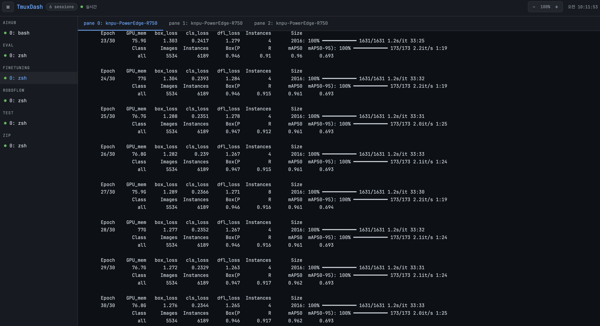

# UnivDash
tmux 안의 **Claude Code / Codex**, **서버 자원 · PM2 프로세스**, **AI 사용량**, **Git 저장소**를 한 곳에서 다루는 FastAPI 대시보드입니다.
휴대폰에서 쓰는 것을 먼저 생각해 만들었고, 홈 화면에 추가하면 앱처럼 실행됩니다 (아래 "아이폰 앱으로 쓰기").
테마: 오로라 / 그라디언트 메시 / 애플 글래스 / 미니멀 플랫, 다크·라이트. (PM2Dash 의 기능을 모두 합쳤습니다)

<p align="center">
  
</p>

## 주요 기능

**Workspace (`/`)**
- 모든 tmux 창을 한 목록으로: 에이전트 종류(Claude/Codex/셸), 작업 제목, 경로, 마지막 활동 시간
- **정렬 기준**(검색창 옆 버튼): 상태순(기본 — 답변이 왔는데 안 읽은 창 → 작업 중 → 응답 필요 → 대기 순) · 최근 활동순 · 이름순 · 직접 지정. 폴더 구분은 유지하고 폴더 안에서 정렬
- 에이전트 상태 추정: `작업 중` / `응답 필요`(권한·선택 프롬프트) / `대기` — 필터 칩과 알림 토스트, 새 출력 점 표시
- **대화 기록**: Claude Code 는 전체 화면(alternate screen)이라 tmux 스크롤 기록이 없어서, 에이전트 세션 로그
  (`~/.claude`, `~/.codex`)를 읽어 처음부터 끝까지 스크롤되는 대화 기록을 보여줍니다. 위로 올리면 이전 대화를
  자동으로 더 불러오고, 도구 실행 · 결과는 접어서 표시, 실시간 갱신
- 터미널 화면 실시간 표시 (ANSI 색상, 커서), 보기 방식 3가지: 줄바꿈(모바일) · 화면 맞춤 · 원본
- 프롬프트 입력창: 여러 줄은 bracketed paste 로 붙여넣은 뒤 Enter — Claude Code/Codex 에서 줄마다 제출되지 않음
  - `Enter 자동 제출` 끄면 입력만 해두기, 창별 임시 저장, 빠른 문구 · 최근 보낸 프롬프트
- 특수 키 바: Esc, ⇧Tab, ↑↓←→, Enter, 1/2/3, y/n, ^C, ^O, ^R, PgUp/PgDn 등 (눌러도 키보드가 내려가지 않음)
- **직접 입력 모드**(⌨): 누르는 키가 그대로 터미널로 전달 (한글 IME 포함)
- **사진·파일 첨부**: 📎 버튼(모바일은 사진 보관함·카메라·파일), 클립보드 붙여넣기, **드래그앤드롭**
  (터미널 영역에 놓으면 현재 창, 목록의 창 위에 놓으면 그 창에 첨부). 업로드 진행률 · 미리보기 · ✕ 취소
  - 보낼 때 파일 경로를 하나씩 붙여넣어 Claude Code / Codex 가 `[Image #1]` 처럼 이미지로 인식합니다.
    그 외 파일은 경로로 전달되어 에이전트가 읽습니다.
  - 저장 위치 `~/.univdash/uploads` (저장소 밖이라 실수로 커밋되지 않음), 기본 50MB 제한, 7일 뒤 자동 삭제
- 모바일: 목록 → 전체 화면 터미널, 뒤로 가기 버튼/제스처로 목록 복귀, 키보드가 올라와도 입력창 유지
- 새 tmux 세션 만들기 (+ 버튼: 이름, 작업 폴더, Claude/Codex/셸/직접 명령)

**창 정리 (`/organize`)**
- 폴더 만들기(이름·색상), 접기/펼치기
- 손잡이를 끌어서 순서 변경 · 폴더 간 이동 · 폴더 순서 변경 (터치 지원)
- 창 숨기기/다시 표시, **이름 변경 = 실제 tmux 세션 이름 변경** (폴더 · 순서 · 숨김 설정도 따라감)
- Workspace 에서도 길게 누르기 / ⋯ 메뉴로 같은 작업 가능
- 설정은 서버의 `data/preferences.json` 에 저장되어 (Git 목록 설정은 `data/git_preferences.json`) 휴대폰·PC 에서 같이 보입니다 (`세션이름:창번호` 기준).

**서버 & 프로세스 (`/server`)**
- CPU(코어별) · 메모리/스왑 · 디스크 · 네트워크 실시간 표시
- PM2 프로세스 상태 · CPU · 메모리 · 가동 시간, 재시작 / 중지 / 삭제, watch 토글, 자원 그래프, 실시간 로그
- `pm2 save`, 부팅 시 자동 시작(startup) 등록 상태 표시
- **ecosystem.config.js**: 등록된 앱과 실행 상태 목록, 폼으로 새 앱 추가(작업 폴더를 넣으면 실행 파일 · `.venv` 인터프리터 자동 추천),
  추가 후 바로 `pm2 start --only` · 미실행 앱 시작. 기존 파일 서식은 그대로 두고 항목만 끼워 넣으며,
  node 로 다시 읽어 검증한 뒤 `.bak-날짜` 백업을 남기고 교체합니다 (`PM2_ECOSYSTEM_FILE`, 기본 `~/ecosystem.config.js`)

**AI 사용량 (`/ai-usage`)**
- Claude Code · Codex 의 남은 사용량(현재 세션 · 주간), 오늘/7일/30일 토큰 통계
- 일별 · 시간대별 · 요일별 차트, 토큰 구성, 모델별 · 프로젝트별 사용량

**Git 관리 (`/git`)**
- 저장소 자동 탐색(`GIT_REPOSITORY_ROOTS` / `GIT_REPOSITORIES`), 폴더 · 순서 · 숨김 · 별칭 · 즐겨찾기
- 변경사항 diff, 스테이징/되돌리기, 커밋(amend) · 커밋 & 푸시, fetch / pull(rebase) / push(강제 lease)
- 브랜치 생성 · 전환 · 병합(no-ff/squash) · 삭제, 스태시, 커밋 상세 · revert, 콘솔 출력

## 아이폰 앱으로 쓰기 (홈 화면 앱)
1. 아이폰 **Safari** 로 UnivDash 주소(HTTPS)에 접속해 로그인합니다.
2. 공유 버튼 → **홈 화면에 추가** → 이름 확인 후 추가.
3. 홈 화면의 UnivDash 아이콘으로 실행하면 주소창 없이 전체 화면 앱처럼 열립니다.

- 아이콘 원본은 `app/static/icons/icon.svg` 입니다. 바꾸려면 이 파일(또는 180×180 `apple-touch-icon.png`,
  192/512 `icon-*.png`)을 교체하세요. iOS 는 SVG 아이콘을 쓰지 않으므로 PNG 가 필요합니다.
- 앱 이름 · 색상은 `app/static/manifest.webmanifest` 와 `_theme.html` 의 `apple-mobile-web-app-title` 에서 바꿉니다.
- 홈 화면 앱은 Safari 와 로그인(쿠키)을 따로 가지므로 처음 한 번 앱 안에서 로그인합니다.

## 보안
UnivDash 는 터미널 입력 · pm2 · git 을 다루므로 **서버 셸 권한과 같습니다.** 그래서 다음을 기본으로 켜 둡니다.

**로그인**
- `ADMIN_PASS` 12자 이상(약한 값 거부) 또는 `ADMIN_PASS_HASH`(PBKDF2-SHA256 60만 회) — 평문을 .env 에 두지 않을 수 있음
- **2단계 인증(TOTP)**: `ADMIN_TOTP_SECRET` 설정 시 인증 앱의 6자리 코드 필수, 한 번 쓴 코드 재사용 불가
- IP 별 15분에 5회 실패 시 15분 잠금 + 전체(모든 IP 합산) 15분에 30회 실패 시 모든 로그인 잠금
- 무엇이 틀렸는지 알려주지 않는 오류 메시지, 로그인 성공 · 실패 · 로그아웃은 IP · 브라우저와 함께 기록

**세션**
- 쿠키에는 임의 세션 ID 만, 서버의 세션 목록(`data/sessions.json`, 0600, ID 는 해시로만 저장)에 있어야 유효
- 로그아웃 · **모든 기기 로그아웃**(사이드바 "전체")이 서버 재시작 후에도 유지
- 유휴 4시간 / 최대 12시간 만료, 비밀번호나 TOTP 가 바뀌면 기존 세션 전부 무효
- HTTPS 에서는 `__Host-` 쿠키 + `Secure` + `HttpOnly` + `SameSite=Strict`
- 열린 WebSocket 도 10초마다(터미널 입력은 매 메시지) 세션을 다시 확인해 로그아웃 즉시 끊김

**브라우저 공격 차단**
- 외부 CDN 없음: Tailwind(빌드된 CSS) · Chart.js · SortableJS · Font Awesome · 폰트 모두 자체 호스팅
- CSP `script-src 'self'` — 인라인 스크립트 · eval · 외부 스크립트 불가, `frame-ancestors 'none'`, `base-uri 'none'` 등
- CSRF: POST/PUT/DELETE · WebSocket 은 같은 출처의 Origin(또는 Referer)이 **반드시** 있어야 함
- `ALLOWED_HOSTS` 로 Host 헤더 제한 (DNS rebinding 차단), HSTS 2년
- `/docs`, `/redoc`, `/openapi.json` 비활성화, 검증 오류에서 스키마 비노출, Server 헤더 제거, 응답 캐시 금지

**서버 작업**
- tmux · pm2 · git · node 는 shell 없이 인자 리스트로만 실행, 대상은 실제 존재하는 ID/이름만 허용, 키는 허용 목록만
- 첨부: 로그인 확인 후에만 본문 수신 · 크기 제한 · 서버가 정한 파일명(0600) · 다시 내려받는 API 없음
- ecosystem.config.js: 값은 모두 JS 문자열로 이스케이프, node 로 검증 후 백업 · 원자적 교체

**운영 체크리스트**
1. `.venv/bin/python tools/security.py totp` 로 2단계 인증 켜기
2. `.venv/bin/python tools/security.py hash-password` 로 `ADMIN_PASS` 를 `ADMIN_PASS_HASH` 로 바꾸기
3. `SESSION_HTTPS_ONLY=true`, `ALLOWED_HOSTS=실제도메인`, `SECRET_KEY` 32자 이상(`tools/security.py secret-key`)
4. `HOST=127.0.0.1` 로 두고 HTTPS 리버스 프록시(또는 Tailscale 등)로만 노출

> 템플릿이나 JS 에 새 Tailwind 클래스를 쓰면 `tools/build_css.sh` 로 CSS 를 다시 빌드하세요 (CDN 을 쓰지 않으므로).

## 시작하기

```bash
uv sync
cp .env.example .env   # ADMIN_USER / ADMIN_PASS / SECRET_KEY 채우기
python3 run.py         # 또는 uv run python run.py
```

`SECRET_KEY` 는 32자 이상이어야 합니다: `python3 -c "import secrets; print(secrets.token_urlsafe(48))"`

휴대폰에서 접속하려면 HTTPS 리버스 프록시 뒤에 두고 `SESSION_HTTPS_ONLY=true` 를 권장합니다.
같은 네트워크/VPN 에서만 쓸 경우 `HOST=0.0.0.0` 으로 열 수 있습니다.
